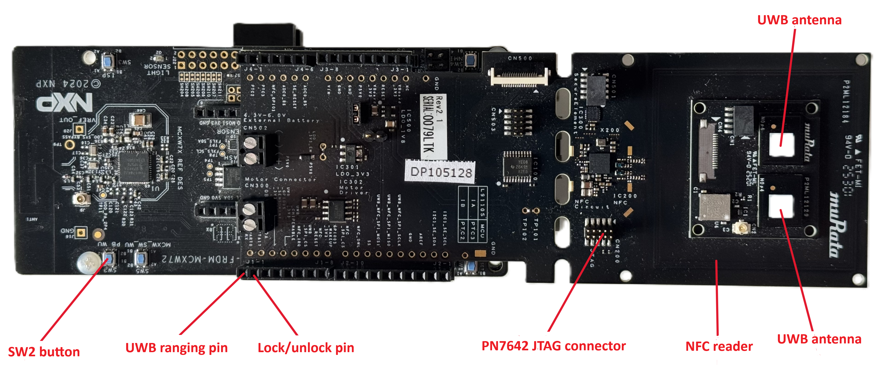

# Matter + ALIRO NXP Door Lock Example Application

- [Matter + ALIRO NXP Door Lock Example Application](#matter-+-aliro-nxp-door-lock-example-application)
  - [Overview](#overview)
  - [Supported Platforms](#supported-platforms)
  - [Environment Setup, Building, and Testing](#environment-setup-building-and-testing)
  - [Data Model](#data-model)
  - [MCXW Instructions](#mcxw-instructions)
  - [Supported Configurations](#supported-configurations)
  - [Board Configuration](#board-configuration)
  - [Device UI](#device-ui)
  - [Flashing](#flashing)
    - [Flashing the `NBU` image with `JLink`](#flashing-the-nbu-image-with-jlink)
    - [Flashing the PN7642 NFC image](#flashing-the-pn7642-nfc-image)
  - [Debugging](#debugging)
  - [GPIOs for Ranging session start and lock/unlock decision](#gpios-for-ranging-session-start-and-lockunlock-decision)
  - [Known issues and limitations](#known-issues-and-limitations)

<a name="overview"></a>

## Overview

This reference application implements a Door Lock device type with ALIRO. It uses board
buttons or `matter-cli` for user input. You can use this example as a reference for creating your
own application.

The example is based on
[Project CHIP](https://github.com/project-chip/connectedhomeip) and NXP SDK, a prototype of a smart
lock device that supports ALIRO access flow using NFC or Bluetooth LE + UWB.

The door lock device communicates with clients over a low-power, 802.15.4 Thread network.
It can be commissioned into an existing Matter network using a controller such
as `chip-tool`.

This example implements a `User-Intent Commissioning Flow`, meaning that the user
is required to press a button in order for the device to be ready for commissioning. The
initial commissioning is usually performed using the `ble-thread` pairing method.

The Thread network dataset will be transferred to the device using a secure
session over Bluetooth LE. In order to start the commissioning process, the user
must enable Bluetooth LE advertising on the device manually. To pair successfully, the
commissioner must know the commissioning information corresponding to the
device: setup passcode and/or discriminator. This data is usually encoded within a
QR code or printed to the device's UART console.

<a name="supported-platforms"></a>

## Supported Platforms

The Door Lock example is supported on the following platforms:

| NXP platform | Dedicated readme                                                                      |
| ------------ | ------------------------------------------------------------------------------------- |
| MCXW72       | [NXP MCXW72 Guide](../../../middleware/matter/docs/platforms/nxp/nxp_mcxw72_guide.md) |

For details on platform-specific requirements and configurations, please refer
to the respective platform's readme.

## Environment Setup, Building, and Testing

All the information required to set up the environment, build the application,
and test is available in the [Matter Documentation for NXP MCU platforms](https://docs.mcuxpresso.nxp.com/matter/latest/html/index.html)

<a name="data-model"></a>

## Data Model

The application uses an NXP specific data model file:

| Path               | Description                          |
| ------------------ | ------------------------------------ |
| `zap/lock-app.zap` | Data model for Door Lock device type |

<a name="mcxw-instructions"></a>

## MCXW Instructions

This reference application implements a Door Lock device type. It uses board
buttons or `matter-cli` for user input. You can use this example as a reference for creating
your own application.

The door lock device communicates with clients over a low-power, 802.15.4 Thread
network.

It can be commissioned into an existing Matter network using a controller such
as `chip-tool`.

This example implements a `User-Intent Commissioning Flow`, meaning that the
user has to press a button in order for the device to be ready for
commissioning. The initial commissioning is done through the `ble-thread` pairing
method.

The Thread network dataset will be transferred to the device using a secure
session over Bluetooth LE. In order to start the commissioning process, the user
must enable Bluetooth LE advertising on the device manually. To pair successfully, the
commissioner must know the commissioning information corresponding to the
device: setup passcode and discriminator. This data is usually encoded within a
QR code or printed to the device's UART console.

## Supported Configurations

**NOTE:** Only Debug configuration is supported for this example. Using the release configuration will cause the device to hang.

| Variant          | Description                                         | Supported Boards      | Project Configuration File | Extra Args                                                    |
| ---------------- | --------------------------------------------------- | --------------------- | -------------------------- | ------------------------------------------------------------- |
| `thread_mtd`     | Thread Minimal Thread Device (MTD) configuration    | frdmmcxw72@cm33_core0 | `prj.conf`                 | `-DCONFIG_MCUX_COMPONENT_middleware.freertos-kernel.config=n` |
| `thread_mtd_ota` | Thread MTD configuration with OTA update capability | frdmmcxw72@cm33_core0 | `prj.conf`                 | `-DCONFIG_MCUX_COMPONENT_middleware.freertos-kernel.config=n` |

## Setting up the ALIRO environment

The ALIRO middleware stack is obtained through controlled access from NXP. It is currently delivered as a zip file.
Please ask your NXP representative to receive access the Aliro SDK package.

Unzip the contents of the ALIRO middleware package to the following directory:
`mcuxsdk/middleware/aliro`

The ALIRO Middleware documentation is located at:

`mcuxsdk/middleware/aliro/Getting_Started.pdf`

`mcuxsdk/middleware/aliro/Aliro_Middleware_Guide.pdf`

## Board Configuration

`FRDM-MCXW72 board` + `muRata Aliro Demo shield` is used for running this Matter reference app:



## Device UI

This reference app uses `matter logging` to output information about the app through a
UART interface.

| interface | role          |
| --------- | ------------- |
| UART1     | Used for logs |

The LED UI has been disabled because of conflicts with the NFC and UWB chips. Even if the LEDs are on, there is no state reported.

## Flashing

We recommend using [JLink](https://www.segger.com/downloads/jlink/) to flash
the PN7642 NFC image and `NBU` core. Please use the latest version of JLink available.

| core  | JLink target     |
| ----- | ---------------- |
| host  | `MCXW727C_M33_0` |
| `NBU` | `MCXW727C_M33_0` |
| NFC   | `PN7642`         |

Note: The `NBU` image should be written only when a new NXP SDK is released.
The NBU image is located at:

`mcuxsdk/middleware/wireless/ieee-802.15.4/bin/mcxw72/mcxw72_nbu_ble_full_15_4_dyn.bin`

### Flashing the `NBU` image with `JLink`

Steps:

- Plug the `FRDM-MCXW72` board into the USB port
- Connect JLink to the device:
  ```bash
  JLinkExe -device MCXW727C_M33_0 -if SWD -speed 4000 -autoconnect 1
  ```
- Run the following commands:
  ```bash
  loadbin <path_to_nbu>/mcxw72_nbu_ble_15_4_dyn_25_09.bin 0x48800000
  reset
  go
  quit
  ```

### Flashing the PN7642 NFC image

The PN7642 NFC image is located at:
`mcuxsdk/middleware/aliro/binaries/nfc/pnev7642fama_aliro_cmd_intf_v01.01.bin`

- Connect an external JLink debugger to the **CN200** connector on the muRata Aliro Demo board.
- Connect External JLink to the device:
  ```bash
  JLinkExe -device PN7642 -if SWD -speed 4000 -autoconnect 1
  ```
- Run the following commands:
  ```bash
  loadbin <path_to_pn7642_bin>pnev7642fama_aliro_cmd_intf_v01.01.bin 0x00208000
  reset
  go
  quit
  ```

## Debugging

In order to run and debug the Matter door lock + ALIRO example on MCXW72 using the VS Code MCUXpresso extension for VS Code,
a minor update is required in the project launch.json configuration that is generated when importing the lock_app_aliro project.
Add `"segger": {"device": "MCXW727"},` like this in the .json file:

```
      "gdbServerConfigs": {
        "linkserver": {},
        "segger": {"device": "MCXW727"},
        "pemicro": {}
      },
      "showDevDebugOutput": "none"
    }
```

## GPIOs for Ranging session start and lock/unlock decision

On the Murata board, J1-1 and J1-2 GPIOs can be used to track the ranging session and lock/unlock events.

| muRata header | MCXW72 GPIO | Usage                                                                       |
| ------------- | ----------- | --------------------------------------------------------------------------- |
| J1-1          | PTA16       | Ranging Session Start Indicator, high when ranging session is active        |
| J1-2          | PTA17       | Lock/Unlock Event Indicator, high when door is unlocked and low when locked |

## Known issues and limitations

- Only Debug configuration is supported for this example. Using the release configuration will cause the device to hang.
- SW3 button on the FRDM-MCXW72 board doesn't work due to pin conflict with the muRata Aliro shield
- UART0 is currently used for the GPIOs that signal ranging session and lock/unlock events and cannot be used for the Matter CLI as described in the [NXP MCXW72 Guide](../../../middleware/matter/docs/platforms/nxp/nxp_mcxw72_guide.md)
- In rare occasions, the image could crash during the ranging session.
